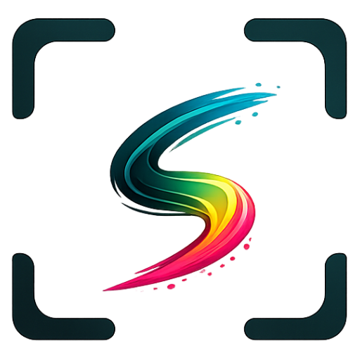

<div align="center">
  <br />
  
  <br /><br />

  <h3><b>editss</b></h3>

  <p><i>Drop it. Mark it. Ship it.</i></p>

  <br />

  <a href="https://edit-studio.github.io/editss">
    
  </a>
  &nbsp;
  
  &nbsp;
  
</div>

<br />

---

<br />

### The fastest way to annotate a screenshot.

**editss** is a browser-native screenshot editor built for people who value their time. No sign-ups, no file uploads, no Electron bloat — just an instant canvas that runs entirely in your browser's memory.

Paste a screenshot, draw an arrow, blur a secret, and hit save. The whole flow takes seconds, not minutes.

<br />

## Why editss?

Most screenshot tools are either too simple (basic crop & draw) or too complex (full image editors with 200 features you'll never use). **editss** sits right in the sweet spot:

- **Instant start.** Paste from clipboard (`⌘V`) or drag a file in. No "File → Open" dialogs.
- **Professional tools.** Arrows, rectangles, ellipses, text, freehand pen, chat bubbles, numbered counters, blur, highlight, and spotlight — everything you actually need.
- **Calm, focused design.** A restrained `parchment & ink` palette keeps the UI out of your way.
- **Full history.** Unlimited undo/redo with `⌘Z` / `⇧⌘Z`. Duplicate objects with `⌘D`.
- **One-click export.** `⌘S` downloads a PNG. `⌘C` copies to clipboard. Done.
- **Completely local.** Your images never leave the browser tab. Zero servers, zero tracking.

<br />

## Keyboard Shortcuts

editss is designed to be driven entirely by keyboard for maximum speed:

| Shortcut | Action |
| :--- | :--- |
| `⌘V` | Paste image from clipboard |
| `⌘C` | Copy annotated image to clipboard |
| `⌘S` | Download as PNG |
| `⌘Z` | Undo |
| `⇧⌘Z` | Redo |
| `⌘D` | Duplicate selected object |
| `Backspace` | Delete selected |
| `Space` (hold) | Pan canvas |
| `Shift` (hold) | Constrain proportions |

<br />

## Tech Stack

| Layer | Technology |
| :--- | :--- |
| Framework | Next.js 15 (Static Export) |
| UI | React 19, Framer Motion |
| State | Zustand |
| Styling | Tailwind CSS 4 |
| Rendering | Canvas API, html2canvas-pro |
| Hosting | GitHub Pages |

<br />

## Getting Started

```bash
git clone https://github.com/edit-studio/editss.git
cd editss
npm install
npm run dev
```

Open `http://localhost:3000/editss` and start editing.

<br />

## Building for Production

```bash
npm run build
```

Generates a fully static bundle in `out/` — deployable to GitHub Pages, Vercel, Netlify, or any static host.

<br />

---

<div align="center">
  <br />
  <sub>Part of the <a href="https://github.com/edit-studio"><b>edit-studio</b></a> ecosystem — frictionless tools for the modern web.</sub>
  <br /><br />
</div>
